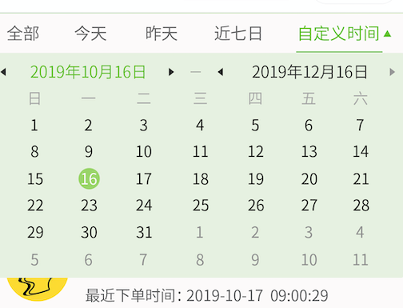
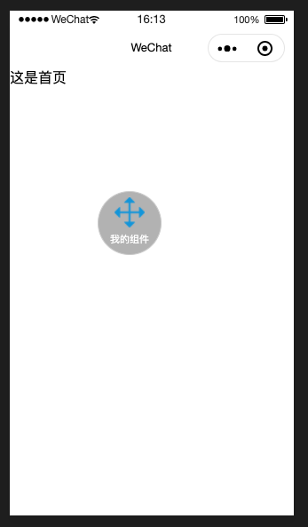
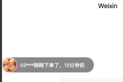

# small_routine_components
微信小程序封装的各种自定义组件：例如： 日期组件等

##### calendar 日历组件

- 参数：  receiveDate String 可选择参数 用于初始化开始时间 
           bind:getcalendar  function 必填参数 用于在用户点击确定的时候接收用户选择的日期

- 使用示例：

```
<calendar receiveDate="{{'2019-11-19'}}"  bind:getcalendar="getCalendarDate" ></calendar>

<calendar  bind:getcalendar="getCalendarDate" ></calendar>

```
> getCalendarDate 为父容器组件定义的函数。

- 效果展示
  
    


##### kaiping 小程序开屏动画

- 参数 imagepath 显示图片的路径   second 倒计时的秒数  bind:hide 点击跳过动画或者倒计时时间到了回调函数


- 使用示例：

```html

<kaiping-component wx:if="{{kaipingFlag}}" 
imagepath="/image/image.png" 
second="{{10}}" 
bind:hide="onMyEvent"   ></kaiping-component>
```
> onMyEvent为父容器组件定义的函数

- 效果展示


##### drag_component 小程序拖拽组件

- 参数 imageUrl 显示的icon图片地址  jumpUrl 点击组件跳转的地址  name 组件下面显示的文字


- 使用示例：

```html

<drag-component
  imageUrl="/drag.png"
  jumpUrl="/index/index"
  name="我的组件"
></drag-component>
```


- 效果展示




##### 定为 小程序逆地址解析 把经纬度解析成真实的地址

详见代码

#### danmu_component 小程序弹幕组件

-  参数 array_data 是一个对象数组，每个对象包含 一个 imageUrl name 和 time

- 使用示例

```html
<danmu_component array_data="{{array}}"></danmu_component>

```
```js

Page({
  data: {
    animationData: {},
    flag: false,
    array: [
      {
        imageUrl: "http://img.hapem.cn/test_product.png",
        name: "li**",
        time: 10
      },
      {
        imageUrl: "http://img.hapem.cn/test_product.png",
        name: "li2**",
        time: 12
      },
      {
        imageUrl: "http://img.hapem.cn/test_product.png",
        name: "li3**",
        time: 13
      }    
    ]
  },})
```

- 效果展示



- 使用建议

如果自己使用，建议后期可以传入位置，然后用代码控制 这个控件在页面上的位置。


   
#### create_qr_code 二维码生成组件

-  参数 showData 二维码要展示的数据或者链接

- 使用示例

```html

<qr_code showData="hahha"></qr_code>

```


- 效果展示


- 使用建议

无
