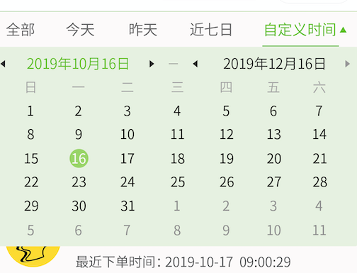

# small_routine_components
微信小程序封装的各种自定义组件：例如： 日期组件等

##### calendar 日历组件

- 参数：  receiveDate String 可选择参数 用于初始化开始时间 
           bind:getcalendar  function 必填参数 用于在用户点击确定的时候接收用户选择的日期

- 使用示例：


```
<calendar receiveDate="{{'2019-11-19'}}"  bind:getcalendar="getCalendarDate" ></calendar>

<calendar  bind:getcalendar="getCalendarDate" ></calendar>

```
> getCalendarDate 为父容器组件定义的函数。

- 效果展示
  
    